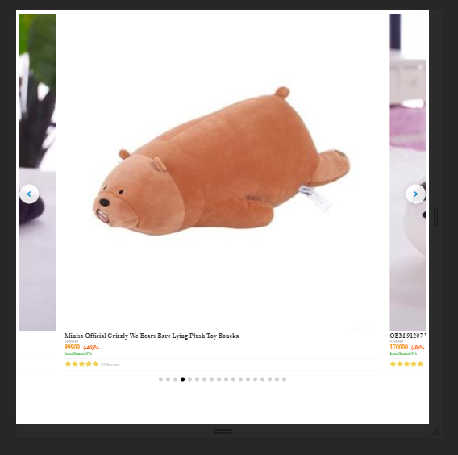

# 🐱🐱🐱 Vue-Cat-Carousel 🐱🐱🐱


Simple, customizable, reactive and lightest Carousel 


## Install

```bash
npm i -S vue-cat-carousel
or
npm install --save vue-cat-carousel
```

## Preview

Desktop Preview


Mobile Preview


## Usage

Plugin install:

Global install
```js
import Vue from 'vue'
import CatCarousel from 'vue-cat-carousel'

Vue.use(CatCarousel)

```

Local install
```js
components: {
  CatCarousel: () => import('vue-cat-carousel')
}
```

How to use it in HTML
```HTML
<cat-carousel
    :items="items"
    :item-per-page="5"
    :indicators-config="{activeColor: '#000', size: 10, color: '#d1d1d1', hideIndicators: false}"
  >
    <template
      slot="item"
      slot-scope="{data, index}"
    >
      <div class="item">{{index}} {{data.name}} </div>
    </template>
  </cat-carousel>
```

```JavaScript
import { CatCarousel } from 'vue-cat-carousel'

new Vue({
  el: 'body',
  components: {
    CatCarousel
  },
  data() {
    return {
      items: [{name: 'hans'}, {name: 'sagita'}]
    }
  }
})
```

## Props

Slider：

| name            | type                             | default    | description                                                            |
| --------------- | -------------------------------- | ---------- | ---------------------------------------------------------------------- |
| items           | list                           | []       | List of items in loop                                                        |
| item-per-page           | number                           | 5    | List of items in one page                                                        |
| centerMode           | Object                           | CENTER_MODE_DEFAULT_CONFIG    | Allow to center carousel item with partial prev/next slides                                                        |
| indicators-config          | Object                           | INDICATORS_DEFAULT_CONFIG    | define carousel indicators item size                                                       |

INDICATORS_DEFAULT_CONFIG

property | type | value | description
--- | --- | --- | ---
size | number | 16 | size of indicators in pixel
color | string | '#d6d6d6' | color of indicators (hex, rgb, etc)
activeColor | string | '#0095da' | color of active indicator (hex, rgb, etc)
hideIndicators | boolean | false | show and hide carousel indicators
prefix | string | '' | add prefix for :key item name

INDICATORS_DEFAULT_CONFIG

property | type | value | description
--- | --- | --- | ---
enabled | boolean | false | enable center mode carousel
paddingCenter | number | 10 | sizes of padding in percentage


## Slots

slot | slot-scope | description
--- | --- | ---
item | data, index | customize the design of carousel item
prev-navigation | prev | customize slide left navigation
next-navigation | next | customize slide right navigation

Previous navigation:
```HTML
<cat-carousel
    :items="items"
    :item-per-page="5"
    :indicators-config="{activeColor: '#000', size: 10, color: '#d1d1d1', hideIndicators: false}"
  >
    <template
      slot="prev-navigation"
      slot-scope="{prev}"
    >
      <div class="custom-navigation" @click="prev"></div>
    </template>
  </cat-carousel>
```

Next navigation:
```HTML
<cat-carousel
    :items="items"
    :item-per-page="5"
    :indicators-config="{activeColor: '#000', size: 10, color: '#d1d1d1', hideIndicators: false}"
    :prefix="'nike'"
  >
    <template
      slot="prev-navigation"
      slot-scope="{next}"
    >
      <div class="custom-navigation" @click="next"></div>
    </template>
  </cat-carousel>
```

Center mode carousel:



```HTML
<cat-carousel
    :items="items"
    :item-per-page="5"
    :centerMode="{enabled: true, paddingCenter: 10}"
    :indicators-config="{activeColor: '#000', size: 10, color: '#d1d1d1', hideIndicators: false}"
  >
  </cat-carousel>
```

# License

MIT
